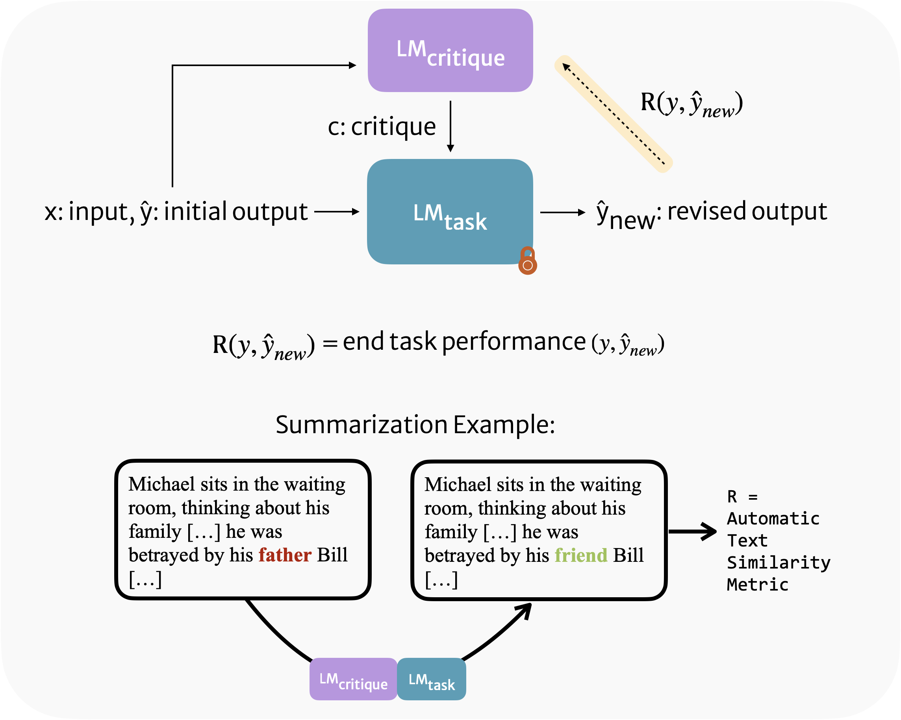

<p align="center">
  
</p>

*Afra Feyza Akyürek, Ekin Akyürek, Aman Madaan, Ashwin Kalyan, Peter Clark, Derry Wijaya, Niket Tandon* to appear at ACL 2023.

Link to the paper: [https://arxiv.org/abs/2305.08844](https://arxiv.org/abs/2305.08844)

Code: [https://github.com/feyzaakyurek/rl4f](https://github.com/feyzaakyurek/rl4f)

## Motivation

Large language models continue to make mistakes. While they understand human-written critiques of their outputs, feedback from humans is not scalable to online settings. Hence, we propose to train a small language model conditioned to critique an LLM. We train a small Critique Model (220x times smaller than GPT-3.5) to critique GPT-3.5 (Task Model). We use task supervision (e.g. for summarization we use context and summary pairs) to train the Critique Model via reinforcement learning. Once we sample a critique utterance from the Critique Model, we use few-shot prompting to get a revised and improved answer from the Task Model.

## Highlights

RL4F provides a way to bootstrap LLM performance on a task without needing to train the large model using a small computational budget. It also caters to the situations where the task model is black-box which is the case for the major proprietary language models.

## Procedure

### How to use natural language critiques in model outputs?


We use few-shot prompt when we first sample an initial prediction and when we prompt the model to revise its the answer using the critique.


### RL4F: Training the critique model
Having sampled a critique utterance from the critique model we prompt the task model for a revision. We compare the revision to a ground truth output (e.g. human-written summary for the summarization task). We use automatic metrics to quantify the quality of the revision and use that as a reward signal.

<p align="center">
  
</p>


### Applying RL4F iteratively
At evaluation, we sample critiques from the critique model iteratively and observe improvements for alphabetization task.
<p align="center">
  
</p>

### Scaling RL4F
Our default critique model is a fine-tuned T5-large checkpoint by default. We conduct experiments usind differently-sized T5 models and find that increasing the model size increase the end-task performance. Check out the paper for details.


### Results
RL4F yields improvements over retrieval-based, self-refinement and supervised baselines. Check out the paper for descriptions of these baselines and the appendix for a comparison to subsequent works such as [Self-Refine](https://arxiv.org/abs/2303.17651).

<p align="center">
  
</p>


### Sample critiques from RL4F
Below are some examples from the appendix in the paper where RL4F critiques were useful. There are also examples when the revised answer is not better than the initial answer even though the critiques were reasonable.

**Samples for Action Planning**


**Samples for Alphabetization**


**Samples for Summarization**


```
@article{akyurek2023rl4f,
  title={RL4F: Generating Natural Language Feedback with Reinforcement Learning for Repairing Model Outputs},
  author={Aky{\"u}rek, Afra Feyza and Aky{\"u}rek, Ekin and Madaan, Aman and Kalyan, Ashwin and Clark, Peter and Wijaya, Derry and Tandon, Niket},
  journal={arXiv preprint arXiv:2305.08844},
  year={2023}
}
```
